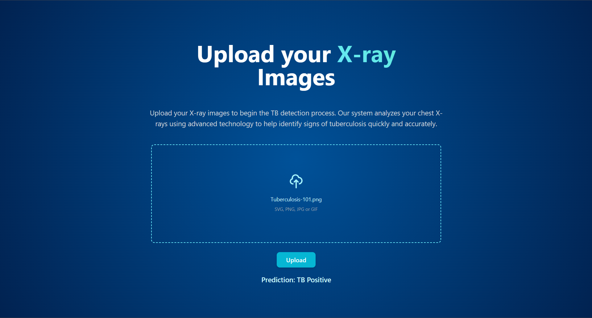
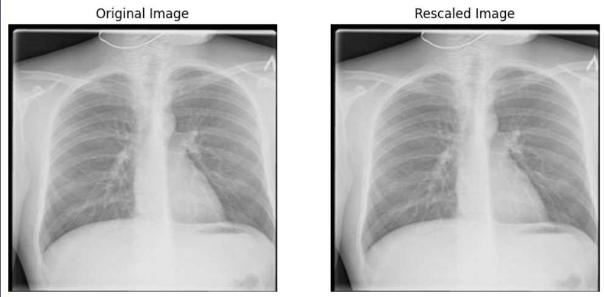
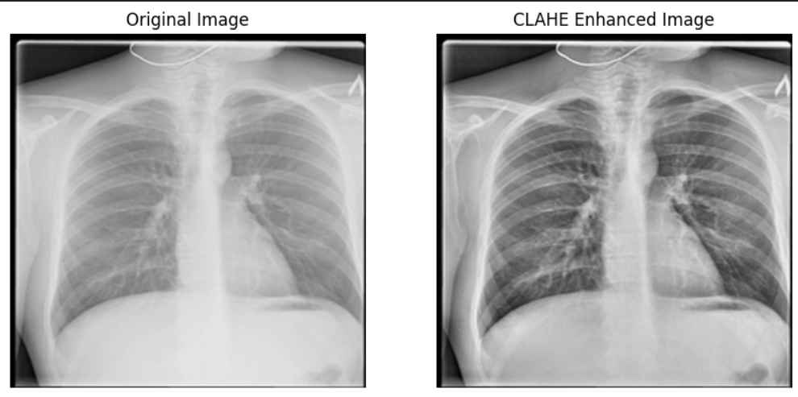
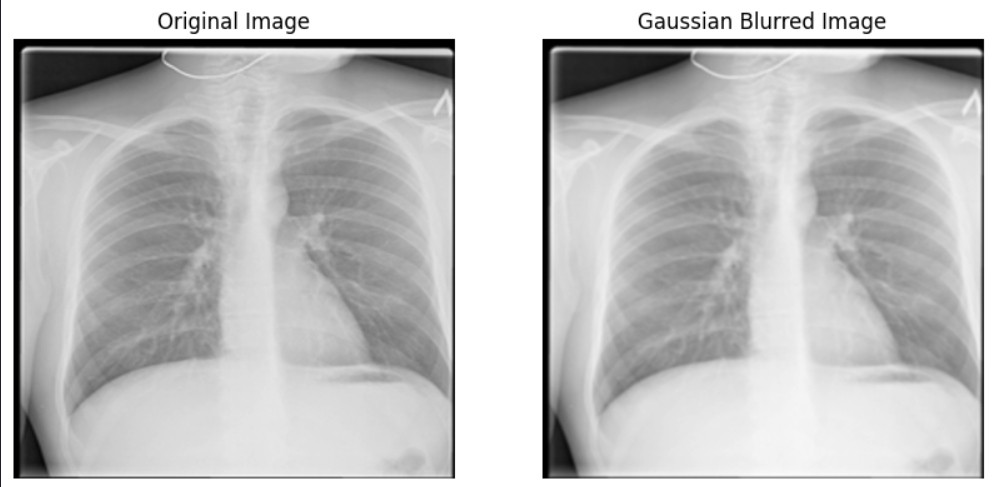
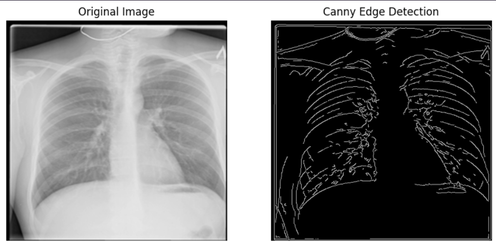
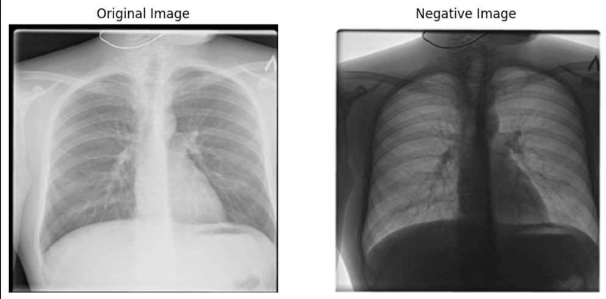
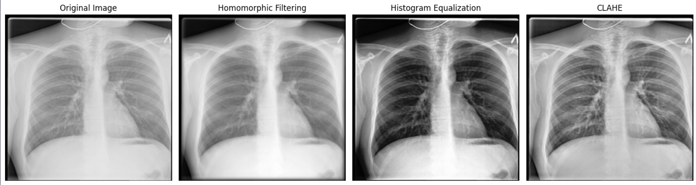

# AI for TB Diagnosis using Chest X-rays

## Overview

This project aims to develop an AI-powered solution for the detection of Tuberculosis (TB) using chest X-ray images. TB continues to be a major public health issue, particularly in resource-limited regions where access to radiologists is scarce. By leveraging deep learning, this tool can help automate the diagnosis process, enabling faster and more accurate detection of TB.

## Dataset

* **Size**: 5,000 chest X-ray images
* **Classes**: TB-positive and TB-negative
* **Source**: Public datasets (e.g., Kaggle Chest X-ray Dataset)

## Image Preprocessing and Augmentation

To improve generalization and robustness, several preprocessing and augmentation techniques were applied:

* **Rescaling (Normalization)**: Scaled pixel values to \[0, 1]
  
* **Contrast Enhancement**: Applied CLAHE (Contrast Limited Adaptive Histogram Equalization)
  
* **Noise Removal**: Used Gaussian Blurring to smooth images
  
* **Edge Detection**: Applied Canny edge detector to highlight features
  
* **Image Negative**: Used image inversion to analyze contrast behavior
  
* **Homomorphic Filtering**: Enhanced both contrast and illumination
  
* **Feature Extraction**: Extracted features to improve model understanding

## Models Used for Comparative Study

We conducted a comparative analysis using three different CNN architectures:

* **ResNet50** (Transfer Learning)
* **DenseNet** (Transfer Learning)
* **Simple CNN** (custom model)

### Key Findings

* **ResNet50** and **DenseNet** outperformed the Simple CNN in accuracy and AUC-ROC.
* **Simple CNN** had faster training times and was easier to deploy.

## Current Repository

The repository includes:

* A **Simple CNN** model
* Image preprocessing pipeline
* **Frontend integration** to allow basic user interaction for uploading and diagnosing X-ray images

## Results

* **Test Accuracy**: \~90%
* **Precision**: 0.91
* **Recall**: 0.89
* **F1-Score**: 0.90
* **AUC-ROC**: 0.94

## Future Work

* Fine-tuning pre-trained models with more data
* Deploying the model in clinical settings
* Building a mobile/web-based diagnostic tool
* Integrating patient metadata and multi-modal diagnostic inputs

## References

* Kaggle Chest X-ray Dataset
* ResNet & DenseNet papers
* Grad-CAM for model visualization

---

> This project is a step towards using deep learning in solving real-world health issues, especially in under-resourced regions.
